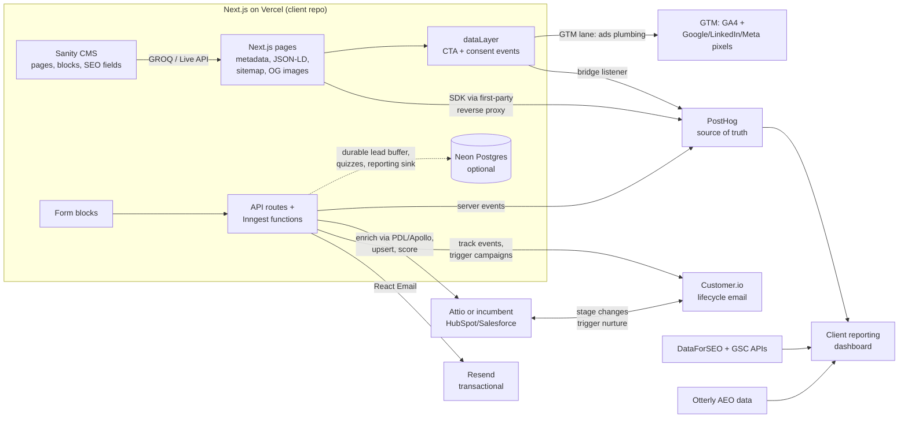

# The MarTech Stack: Final Report and Offer

A fractional MarTech engineering practice for B2B marketing teams (51-500 employees). One senior engineer migrates clients onto a standard stack (this repo's Next.js + Sanity + Vercel template plus the tools below) and runs website, SEO, analytics, email, and integrations on a monthly retainer, 6-month minimum.

This document is the single authoritative version. It consolidates three rounds of research and two adversarial challenge rounds (July 2026); the full research trail lives in `MARTECH-STACK-RESEARCH.md` (archived, currently at `~/Desktop/MARTECH-STACK-RESEARCH.md`). Every recommendation here is the surviving one. Where an earlier pick was overturned, a "considered and rejected" note explains why, so client questions about familiar names have ready answers. All pricing is July 2026 US list pricing; re-verify before contracts.

---

## 1. The philosophies (what the template already encodes)

These five principles came out of auditing the template codebase. They are the selection criteria every tool below was scored against, and they double as positioning language.

1. **Marketing velocity through blocks.** Pages are Sanity documents composed from 18 typed section blocks, rendered through one catch-all route and one block registry. A marketer ships a landing page in minutes with no deploy. Evidence: `sanity/schemas/components/page-builder-schema.ts`, `components/sections/index.tsx`. Industry baseline this beats: ~13 days per landing page, 38% of marketing teams need a developer for most campaigns ([MarTech benchmark](https://martech.org/why-some-teams-launch-faster/), [Contentful](https://www.contentful.com/blog/why-marketing-teams-feel-slower-than-ever/)).
2. **SEO is code, centralized.** One file (`lib/seo.ts`) handles the metadata cascade, an OG-image waterfall (custom upload, then auto-generated per page via `/api/og`, then global, then default), and JSON-LD generators (WebPage, Event, Organization, WebSite, FAQ auto-extracted from any FAQ block). Sitemap and robots.txt generate from CMS content with real `lastModified` dates.
3. **AI-safe architecture.** Typed schema mirrors for every block, centralized GROQ queries composed from shared fragments, one predictable 4-file pattern for new content types, defensive try/catch rendering that degrades gracefully. Claude Code can make sweeping changes without taking a site down. Verified: `pnpm build` passes cleanly (12 static pages, SSG on `[slug]` and `/events/[slug]`).
4. **Instrumentation is baked in and tool-agnostic.** A dataLayer-first GTM utility with Consent Mode v2; CTA click tracking attaches automatically to any CMS-configured link with a `trackingId`, enriched with text, section location, and destination. Any analytics destination can subscribe without code changes.
5. **Replicable core, per-client skin.** The block system, SEO layer, queries, tracking, and form pipeline are the product; design tokens, fonts, and brand content are the per-client service. Client-owned accounts and version-controlled integrations make every engagement exit-friendly by construction.

**Template gaps to close before the first client** (prerequisites, not open questions): a blog/post content type with Article JSON-LD, canonical URLs (`alternates.canonical` is currently absent), CMS-driven redirects, form-to-CRM persistence (forms currently only send a notification email), brand-string extraction to config, and server-side event capture.

---

## 2. The final stack

| Function | Tool | Monthly cost | Held by |
|---|---|---|---|
| CMS | Sanity | $0 free tier to ~$45-75 on Growth at $15/seat ([pricing decode](https://robotostudio.com/blog/sanity-cms-pricing-which-plan-is-right-for-you)) | Client |
| Hosting | Vercel Pro | ~$20/seat, one agency seat spans client projects ([Vercel pricing](https://vercel.com/pricing)) | Agency seat, client project |
| Analytics | PostHog + GA4 via GTM | $0 with config discipline (sampled replay, curated autocapture, client-side flags, billing caps); unsampled replay would cost ~$150-225/mo per client ([Userpilot analysis](https://userpilot.com/blog/posthog-pricing/)) | Client org, agency invited |
| Attribution | UTM to hidden form fields to CRM, closed loop | $0 built, or [Attributer](https://attributer.io) ~$49/mo; add Dreamdata Free for HubSpot clients ([Dreamdata pricing](https://dreamdata.io/pricing)) | Client |
| Lifecycle email | Customer.io | $100/mo at 2k contacts, ~$145 at 10k, ~$325 at 25k ([pricing](https://customer.io/pricing)) | Client-owned; agency joins the partner program for revenue share (verified, section 9) |
| Transactional email | Resend | $0-20/mo ([pricing](https://resend.com/pricing)); React Email templates live in the client repo | Client |
| SEO data | DataForSEO + GSC API + Screaming Frog | ~$50-75/mo total across ALL clients ([DataForSEO](https://dataforseo.com/pricing), [Screaming Frog $259/yr](https://www.screamingfrog.co.uk/seo-spider/pricing/), GSC free) | Agency |
| AEO monitoring | Otterly.AI Lite | $29/mo ([pricing](https://otterly.ai/pricing)), upsell depth per client | Agency |
| CRM | Attio Pro (greenfield) or integrate the incumbent | Attio $69/seat annual ([pricing](https://attio.com/pricing)); incumbent integration $0 | Client |
| Enrichment | PeopleDataLabs primary, Apollo fallback, inside the pipeline | ~$50/mo per client at 500 leads/mo ([PDL pricing](https://www.peopledatalabs.com/company-data/enrichment-api)) | Client pass-through |
| Orchestration | Custom TypeScript in the client repo + Inngest | Free to 50k runs/mo, Pro ~$99/mo shared ([pricing](https://www.inngest.com/pricing)) | Agency account, code in client repo |
| Visual automation (when needed) | Windmill CE, one workspace per client | ~$6/mo VPS; AGPL permits pooled hosting, workspaces isolate tenants ([pricing](https://www.windmill.dev/pricing), [license](https://www.windmill.dev/terms/2025-12-01)) | Agency instance |
| Database (optional) | Neon Postgres | $0-20/mo per client, scale-to-zero ([Neon pricing](https://neon.tech/pricing)) | Client |

**Data flow:**

### Considered and rejected (the names clients will ask about)

- **Ahrefs** ($249/mo Standard). Good product, wrong buy for an engineer. Its Standard-tier API is capped at 25 rows per request with no pagination and no mid-month unit top-ups, and the "free" rank-tracker endpoints only read back data the subscription collects ([API docs](https://docs.ahrefs.com/en/api/docs/introduction)). The DataForSEO + GSC + Screaming Frog stack delivers the same reporting for ~$50-75/mo and turns SEO reporting into owned code. Trade-off accepted: roughly one week of one-time pipeline engineering (ASSUMPTION on duration). SE Ranking Core ($103/mo annual, white-label reports, AI-search tracking included, [pricing](https://seranking.com/subscription.html)) is the hedge if a client-facing suite UI proves necessary.
- **Semrush**. API gated behind the ~$500/mo Business tier plus paid unit add-ons; its AI Visibility Toolkit charges $99/mo per domain, which breaks multi-client economics ([Semrush pricing](https://www.semrush.com/pricing/), [AI Toolkit](https://www.semrush.com/pricing/ai/)).
- **HubSpot (as a deployment)**. The APIs an engineer actually wants (custom objects, behavioral events) are Enterprise-gated at 10-50x Attio's cost, and Marketing Hub would replace the template's forms and landing pages, inviting "why do we pay you when HubSpot does this?" ([HubSpot pricing](https://www.hubspot.com/pricing/marketing)). For the majority of clients who already run HubSpot or Salesforce (~91% of 10+ employee companies have a CRM, [Resonate](https://www.resonatehq.com/blog/hubspot-market-share)), the posture is integrate, never rip out.
- **Zapier**. Per-task pricing compounds hard above ~5k runs/month ([2026 analysis](https://www.nocode.mba/articles/zapier-pricing-2026)), and revenue-path integrations should never live in a tool the client cannot take with them. Used only when a client already owns and pays for it.
- **n8n**. Its Sustainable Use License forbids pooling multiple clients on one self-hosted instance ([n8n help center](https://support.n8n.io/article/can-i-use-your-license-for-my-use-case)); Windmill's AGPL does not, and Windmill is code-first with git sync.
- **Klaviyo** (ecommerce-shaped, most expensive at 25k contacts), **Amplitude** (Enterprise-gated multi-project, sales-led cliff), **Mailchimp-class tools** (no engineer leverage), **RevOps platforms** (Cargo, Default: they sell "no more custom integrations," which is this practice's product), **CDPs by default** (overkill below ~10k customers and a handful of systems, [build/buy/skip matrix](https://www.digitalapplied.com/blog/cdp-2026-build-buy-or-skip-decision-matrix)); RudderStack per client is the on-ramp at ~5+ destinations ([RudderStack pricing](https://www.rudderstack.com/competitors/rudderstack-vs-segment/)).

### The foundation itself (pressure-tested, kept)

- **Next.js**: Astro won the generic marketing-site argument in 2025-2026 (agency consensus, Cloudflare [acquired Astro](https://www.cloudflare.com/press/press-releases/2026/cloudflare-acquires-astro-to-accelerate-the-future-of-high-performance-web-development/)), but this practice's case is the exception: one amortized template, API routes as the integration layer, the largest AI-training corpus for an agent-operated codebase, and Next.js 16's explicit caching model already adopted. Patch RSC CVEs fast; that is part of the retainer's job.
- **Sanity**: kept. Real risk is unilateral repricing, not tech (watch the add-on ladder: extra datasets $999/mo). Payload was removed as the safe alternative by Figma's June 2025 [acquisition](https://payloadcms.com/posts/blog/payload-is-joining-figma); Storyblok's visual-editor advantage is neutralized by the template's already-built visual editing.
- **Vercel**: kept with hedges. One Pro seat spans all client projects at low traffic (~$20-60/mo total). Hedges: Cloudflare DNS in front of every site, no Vercel-proprietary APIs, OpenNext-on-Workers as the known exit. Self-hosting costs more in engineering time than it saves ($2,250-4,200/yr, [Autonoma](https://getautonoma.com/blog/coolify-vs-vercel)).

---

## 3. Judgment calls (when to swap the default)

| Function | Default | Swap when |
|---|---|---|
| CMS | Sanity | Never (it is the template). Heavy WordPress content gets migrated in, not accommodated. |
| Analytics | PostHog | Plausible Business ($19+/mo, [pricing](https://plausible.io/#pricing)) for EU-strict or consent-banner-averse clients. Amplitude only if the client already has product-analytics maturity there: integrate, do not migrate. GA4 always present, never the analysis layer. Diarize June 15, 2026: `ad_storage` becomes the single consent control for GA4-to-Ads data ([detail](https://www.uniconsent.com/blog/google-ads-consent-mode-change-2026)). |
| Lifecycle email | Customer.io | Loops ($49-99/mo, [pricing](https://loops.so/pricing)) for smaller or simpler clients. Klaviyo only if the client sells ecommerce. Incumbent HubSpot Marketing Pro+ gets used via API rather than duplicated. |
| SEO data | DataForSEO + GSC | SE Ranking Core ($103/mo) when a client-facing suite UI is required. Ahrefs Standard remains the honest convenience buy if the reporting pipeline never gets built. |
| AEO | Otterly Lite | Scrunch Agency ($500/mo, [pricing](https://scrunch.com/pricing/)) when clients need Claude/Gemini coverage or raw AI responses; per-client Semrush AI Toolkit ($99/domain, client-paid) only on explicit demand. |
| CRM | Attio Pro | Integrate the incumbent (the majority case). HubSpot Starter ($20/seat) only when the client insists and is too small for tier-gating to hurt. |
| Orchestration | Custom TS + Inngest | Trigger.dev ($20-50/mo, Apache-2.0, self-hostable, [pricing](https://trigger.dev/pricing)) if self-hosting or long-running jobs matter. Windmill workspace for flows the client's ops person must self-edit. Zapier/Make on client-owned accounts only. |
| Enrichment | PDL + Apollo waterfall in code | Clay ($185-495/mo, [pricing guide](https://astragtm.io/guides/clay-pricing-2026)) as a project-billable tool for outbound list-building. Breeze credits for HubSpot-committed clients. |
| CDP | None | RudderStack per client past ~5 destinations / ~50k tracked users / ad-audience syncs. Warehouse-native tools (Hightouch, Census, Cargo) only when the client already has a warehouse and data team; that is a graduation event. |
| Database | None | Neon when app-like features appear: durable lead buffer, quizzes/calculators, webinar registration state, agency-side reporting sink. Never a shadow CRM; lead status lives in the CRM. |

---

## 4. Cost model

**Agency-held, shared across all clients:**

| Item | Monthly |
|---|---|
| DataForSEO usage | ~$40-55 ([pricing](https://dataforseo.com/pricing)) |
| Screaming Frog | ~$22 ($259/yr, [pricing](https://www.screamingfrog.co.uk/seo-spider/pricing/)) |
| Otterly Lite | $29 ([pricing](https://otterly.ai/pricing)) |
| Inngest | $0 free tier, $99 Pro when outgrown ([pricing](https://www.inngest.com/pricing)) |
| Windmill VPS | ~$6 (ASSUMPTION: entry Hetzner/DO box) |
| Vercel Pro seat | $20 ([pricing](https://vercel.com/pricing)) |
| **Total** | **~$120-230/mo** |

At 4 clients that is ~$30-58 per client per month, under 1.2% of the entry retainer.

**Client-held (pass-through, deliberately, for exit-friendliness):** Sanity $0-75, PostHog $0 (configured), Customer.io $100-325 by list size, Resend $0-20, Attio ~$207 for 3 seats or $0 with an incumbent CRM, enrichment ~$50, Mux ~$10-30 (usage), Neon $0-20 when used. **Typical client total: ~$160-700/mo**, which the client pays directly. Research on fractional practices supports this: marked-up tools become a churn grievance; charge for operating the stack, not reselling it ([Vendasta on reseller margins](https://www.vendasta.com/blog/software-reseller-margins/), practice consensus).

**Margin logic:** the retainer absorbs only ~$30-60/client of shared tooling, roughly 99% gross margin on tools. The binding constraint is operator time (see capacity model, section 5).

---

## 5. The offer: three tiers

Pricing is grounded in comps: GTM-engineering retainers run $6-12k/mo with 3-6-month terms ([factors.ai guide](https://www.factors.ai/blog/gtm-engineering-agency)), fractional CMO retainers average $10-12k/mo ([gofractional](https://www.gofractional.com/blog/fractional-cmo-salary)), and WebOps retainers start ~$6k/mo (Refokus, via [foursets](https://www.foursets.com/blog/best-webflow-enterprise-agencies)). The allowance structure copies Roboto Studio's defense against scope creep: a fixed monthly improvement allowance with scope agreed at signup ([Roboto retainer](https://robotostudio.com/services/sanity-support)).

**A deliverable** (the allowance unit) is one of: a landing page composed and launched, a new section block designed and built, an integration built or modified, a technical SEO fix batch, an email template or journey step, an experiment set up and read out. One deliverable ≈ 2-4 operator hours with Claude Code leverage (ASSUMPTION, calibrate after the first two clients).

All tiers: 6-month minimum, month-boundary tier changes, client owns every account and the repo.

### Tier 1: Foundation, $5,000/mo

*For the Marketing Director with an aging site, leads dying in a shared inbox, and no budget headcount for a marketing ops hire.*

- **Deployed and operated:** template migration with the client's brand applied, 301 redirect map and SEO preservation, PostHog configured (sampled replay, billing caps) plus the GA4/GTM ads lane, form-to-CRM pipeline with enrichment (Attio or incumbent), Resend transactional email, GSC + DataForSEO baseline reporting.
- **Migration scope:** up to ~25 pages migrated onto blocks; larger sites are a scoped one-time project (ASSUMPTION on the threshold).
- **Reporting:** monthly dashboard plus a written narrative and a 30-minute readout call.
- **Allowance:** 2 deliverables/mo.
- **Excluded:** lifecycle email program operation, AEO monitoring, experiments, webinar pipelines.
- **Implied load:** ~15 hrs/mo steady state (ASSUMPTION); migration adds ~40-60 hrs across the first 6-8 weeks (ASSUMPTION).
- **Upgrade trigger:** contact list past ~5k needing journeys, paid spend needing closed-loop proof, or hitting the allowance ceiling two months running.

### Tier 2: Growth Engine, $8,000/mo

*For the Marketing Director with real inbound volume who presents pipeline numbers to a CFO every quarter.*

- **Everything in Foundation, plus:** Customer.io lifecycle program (deployed and operated; journeys built from the allowance), closed-loop UTM-to-CRM attribution with a quarterly spend-reallocation review, AEO monitoring with a quarterly schema/content sprint, one A/B experiment per month via PostHog flags.
- **Reporting:** biweekly dashboard updates, monthly narrative and call.
- **Allowance:** 4 deliverables/mo.
- **Excluded:** same exclusions as Foundation minus lifecycle email; still no media buying, no brand/creative.
- **Implied load:** ~25 hrs/mo steady state (ASSUMPTION).
- **Upgrade trigger:** a webinar/events motion, SDR routing complexity, an interactive-content roadmap, or the client starting to scope a marketing ops hire.

### Tier 3: Pipeline Partner, $12,000/mo

*For the VP Marketing who needs a marketing ops manager plus a developer and would rather have one accountable senior operator than two hires.*

- **Everything in Growth Engine, plus:** webinar/event registration pipelines measured end-to-end (attacks the attribution gap 93% of B2B teams report, [Livestorm 2026](https://livestorm.co/blog/why-webinars-are-critical-for-b2b)), G2 review display via official embed widgets for SaaS clients (a seller-facing review API does not exist; see Verification Log, section 9), interactive assets (calculators/quizzes on Neon), speed-to-lead instant routing and sequences (the 42-hour-average problem, [MIT/InsideSales](https://25649.fs1.hubspotusercontent-na2.net/hub/25649/file-13535879-pdf/docs/mit_study.pdf)), roadmap ownership with a weekly standing call, 2-business-day turnaround on allowance items.
- **Allowance:** 6 deliverables/mo.
- **Price anchor:** a loaded marketing ops FTE runs $125-170k/yr, $10.4-14.2k/mo ([salary data](https://www.salary.com/research/salary/alternate/marketing-operations-manager-salary)), and cannot ship Next.js pages or TypeScript integrations.
- **Implied load:** ~40 hrs/mo steady state (ASSUMPTION).
- **Upgrade trigger from here:** the client builds an in-house team; the exit path is a paid handoff sprint (runbook, training), which the client-owned architecture makes clean.

### Explicitly excluded at every tier (boundaries in writing at signup)

Drawn from the documented failure modes: no on-call developer tickets outside the allowance and agreed turnaround; no brand strategy, creative origination, or long-form copywriting; no media buying or ads management (wiring conversion feeds yes, running campaigns no); no application development beyond marketing-site features; no 24/7 or same-day SLAs. Anything outside scope is a separate written SOW. This is the defense against the top two reported failure modes: bespoke regression within 90 days ([SPP](https://spp.co/blog/challenges-productizing-service/)) and becoming the on-call dev ([Liberman](https://www.melisaliberman.com/blog/fractional-consulting)).

### Capacity model

Basis: 25-30 hrs/week of delivery capacity (~110-130 hrs/mo), one senior operator with Claude Code leverage, zero current clients. Steady-state hour estimates are ASSUMPTIONS until calibrated. Onboarding adds ~40-60 hrs per new client in the first 6-8 weeks (ASSUMPTION), which caps intake at roughly one new client per month.

| Target MRR | Best mix | Steady-state hrs/mo | Verdict |
|---|---|---|---|
| $20k | 1x$12k + 1x$8k | ~65 | Comfortable; capacity to onboard the next client |
| $20k | 4x$5k | ~60 | Same hours but 4 relationships and 4 onboardings; context-switching makes this the worse path (ASSUMPTION) |
| $40k | 2x$12k + 2x$8k | ~130 | At the ceiling; no onboarding slack, vacation risk is real |
| $40k | 1x$12k + 2x$8k + 2x$5k + 1 partial | ~135+ | Breaks; too many relationships |
| $60k | 5x$12k | ~200 | Breaks solo. Requires a subcontractor for delivery, or 40+ hr weeks, or repricing |

**Where the model breaks:** ~$40-45k MRR at this capacity. The levers at that point, in order of preference given the positioning: raise prices on renewals (the comps support $8-12k as the center of the market, not the top), drop the Foundation tier for new clients, subcontract delivery (which reintroduces the bus-factor objection the model was designed to answer), or productize the migration as a fixed-fee project handled between retainer cycles. Deliberately not modeled: hiring, which changes the business entirely.

**Cold-start note (zero clients today):** the first client's migration consumes most of a month's capacity. Consider an explicit founding-client structure, such as 2 clients at $4k for a public case study each (ASSUMPTION, a marketing decision, not a research finding), because the business-model research showed the practice sells on demonstrated systems, and the comps (Roboto) use an open-source template plus published work as the lead-gen flywheel.

---

## 6. Sales evidence

### CMO pain points this stack addresses (survey-backed, 2025-2026)

| Pain point | The stat | Verdict |
|---|---|---|
| Proving ROI to CFO/CEO | 63% of CMOs feel CFO pressure to prove value, up from 52% in 2023 ([Duke CMO Survey, Spring 2025](https://www.fuqua.duke.edu/duke-fuqua-insights/marketing-strategic-influence-expands-as-does-scrutiny)) | SOLVES for this segment: closed-loop UTM-to-CRM plus monthly narrative. Not MMM; do not oversell. |
| Martech underutilization | Only 49% of stack tools actively used; causes: overlap 30%, talent 28%, sprawl 27% ([Gartner 2025 Martech Survey](https://www.gartner.com/en/documents/7071298)) | SOLVES: a lean stack run by the person who built it. |
| Slow launches / dev bottleneck | 38% of teams need a developer for most campaigns ([Contentful](https://www.contentful.com/blog/why-marketing-teams-feel-slower-than-ever/)); ~13 days per landing page ([MarTech](https://martech.org/why-some-teams-launch-faster/)) | SOLVES; the most demo-able pain. Blocks, publish, minutes. |
| Data silos | ~90% report siloed systems; only 18.2% have integrated attribution ([RevSure 2025](https://www.revsure.ai/resources/whitepapers/the-state-of-b2b-marketing-attribution-2025)) | SOLVES the core funnel; ads/sales/finance stay outside. |
| MOps talent gap | 28% cite recruiting difficulty ([Gartner](https://www.gartner.com/en/documents/7071298)); loaded MOps hire $125-170k ([salary data](https://www.salary.com/research/salary/alternate/marketing-operations-manager-salary)) | SOLVES: the fractional model is the answer. |
| Agency dissatisfaction | 39% of CMOs plan agency budget cuts ([Gartner 2025](https://www.gartner.com/en/newsroom/press-releases/2025-05-12-gartner-2025-cmo-spend-survey-reveals-marketing-budgets-have-flatlined-at-seven-percent-of-overall-company-revenue)) | SOLVES as the alternative: one accountable operator vs 2-3 uncoordinated retainers at $8.5-22.5k/mo combined ([SEO](https://b2bseo.io/blog/seo-cost/), [email](https://www.inboxarmy.com/blog/email-marketing-agency-pricing/), [dev](https://dribbble.com/resources/tips/web-development-agency-costs)). |
| Flat budgets | 7.8% of revenue, 18% below the 2022 mean ([Gartner 2026](https://www.gartner.com/en/newsroom/press-releases/2026-05-11-gartner-2026-cmo-spend-survey-finds-cmos-allocate-15-point-3-percent-of-marketing-budgets-to-ai-but-only-30-percent-are-ready-to-scale-ai-capabilities)) | PARTIALLY: this is the buying climate; consolidation is the pitch. |
| AI search traffic loss | 51% of B2B software buyers start research with AI chatbots ([G2, Apr 2026](https://www.prnewswire.com/news-releases/new-g2-research-half-of-b2b-software-buyers-now-start-their-research-with-ai-chatbots-302742807.html)); 73% of B2B sites lost traffic 2024-25 ([compilation](https://www.omnibound.ai/blog/ai-seo-statistics)) | PARTIALLY: sell visibility measurement and adaptation, not traffic recovery. |
| Personalization/CDP complexity | 75% say their CDP cost more than expected (Forrester via [CDP.com](https://cdp.com/articles/common-cdp-challenges/)) | PARTIALLY: "the useful 20% of CDP value at 5% of the cost," not a CDP replacement. |
| AI adoption pressure | 70% say AI leadership is critical for 2026; only 30% AI-ready ([Gartner 2026](https://www.gartner.com/en/newsroom/press-releases/2026-05-11-gartner-2026-cmo-spend-survey-finds-cmos-allocate-15-point-3-percent-of-marketing-budgets-to-ai-but-only-30-percent-are-ready-to-scale-ai-capabilities)) | PARTIALLY: an AI-instrumented stack is a credible on-ramp; do not claim AI transformation consulting. |
| Brand building | 63% cannot quantify brand impact ([Duke CMO Survey](https://www.fuqua.duke.edu/duke-fuqua-insights/marketing-strategic-influence-expands-as-does-scrutiny)) | DOES NOT address. No creative, no media. Do not claim it. |

### The engineer's advantage (outcome-framed, for the deck)

1. Ship a landing page in minutes, not sprints; no developer ticket, no deploy, no agency queue.
2. Launch an email campaign from a form submission the same day, no ops ticket.
3. Every lead lands in the CRM enriched, deduplicated, and scored automatically; nothing dies in a notification inbox.
4. See which companies read the pricing page, not just anonymous traffic counts.
5. Recover the 20-35% of traffic that ad blockers hide from competitors' analytics (first-party, server-side tracking).
6. Show up in ChatGPT and Perplexity answers, and prove it, with the fixes shipped in code the same cycle.
7. Rich Google results by adding an FAQ section to any page; the structured data generates itself.
8. Branded social-share images for every page automatically; no designer queue.
9. Measure webinar pipeline end-to-end, closing the gap 93% of B2B teams live with.
10. A/B test messaging without a dev sprint, measured to signup, not to click.
11. Weekly reporting from live APIs, not screenshots.
12. Consent compliance wired so Google still models conversions when users decline cookies.
13. The client owns everything: accounts, data, and integrations as version-controlled code. If the engagement ends, nothing breaks.

### Revenue math (honesty-graded; grades: STRONG independent/replicated, OK credible single source, WEAK vendor-sourced)

- **Site speed.** A 0.1s mobile improvement cut lead-gen bounce 8.3% across 37 brands and 30M+ sessions ([Deloitte, Milliseconds Make Millions](https://www.thinkwithgoogle.com/_qs/documents/9757/Milliseconds_Make_Millions_report_hQYAbZJ.pdf)), STRONG (Google-funded). Average B2B mobile LCP is ~7.05s against Google's 2.5s threshold ([CrUX-based](https://whitehat-seo.co.uk/blog/google-core-web-vitals-guide-for-b2b)), OK. A statically generated site clears the bar by construction.
- **Speed-to-lead.** Average B2B response is 42 hours and 23% never respond ([MIT/InsideSales](https://25649.fs1.hubspotusercontent-na2.net/hub/25649/file-13535879-pdf/docs/mit_study.pdf)), STRONG but dated; 2025 replication: instant response booked 66.7% vs 30% across 4M submissions ([Chili Piper](https://www.chilipiper.com/post/form-conversion-rate-benchmark-report)), OK.
- **Email ROI.** $36-42 per $1, independently from [Litmus](https://www.litmus.com/blog/infographic-the-roi-of-email-marketing) and the UK DMA, STRONG.
- **AEO.** AI-search visitors ~4.4x more valuable than organic per [Semrush's study](https://www.semrush.com/blog/ai-search-seo-traffic-study/), OK (say "Semrush found"). The defensible early-mover claim is structural: LLM citation positions compound and displacing an entrenched source takes months.
- **Baselines.** Median B2B website conversion 2.9% with a 1.1-7.4% industry spread ([Ruler via First Page Sage](https://firstpagesage.com/reports/b2b-conversion-rates-by-industry-fc/)), OK; 80% of B2B seller-buyer interactions digital ([Gartner](https://www.biztechreports.com/news-archive/2020/9/18/80-of-b2b-sales-interactions-between-suppliers-and-buyers-will-occur-in-digital-channels-by-2025-says-gartner)), STRONG.

**Composed examples for the deck:**
1. 10k monthly visits at 1.5% conversion, 20% lead-to-opp, $50k ACV, 25% win rate: reaching the 2.9% median ≈ ~$350k/yr incremental closed revenue at unchanged funnel rates.
2. 150 demo requests/mo at the 42-hour average: even discounting Chili Piper by half (30% to 48% booked) is +27 meetings/mo, ≈ $4M/yr bookings exposure, fixed by a week of routing and sequence work.
3. Page velocity 5 to 20/mo (vendor case study, [Amplitude on Sanity](https://www.sanity.io/customers/amplitude), flag as such): 15 extra pages at 300 visits/mo at 2.9% ≈ ~130 extra leads/mo by month 6, zero new ad spend.
4. AEO compounding: 300 AI-referral visits/mo at Semrush's multiple ≈ 19 leads vs 4 from equivalent organic, and the citation position compounds while a competitor starting in six months starts from zero.

**Do not put in print:** the untraceable "data-driven orgs grow 58% faster / 1.7x" attribution stats, vendor-blog AEO mention-lift percentages (60-80%), and Vercel's ecommerce revenue case studies presented as B2B-applicable.

---

## 7. Risks and failure modes

From documented reports on productized and fractional practices, with the built-in defense for each:

1. **Bespoke regression** (clean offers customized back into custom work within ~90 days, [SPP](https://spp.co/blog/challenges-productizing-service/)). Defense: fixed deliverable allowance, scope agreed at signup, exceptions require a written SOW.
2. **Becoming the on-call dev** (the top named trap for independent fractionals, [Liberman](https://www.melisaliberman.com/blog/fractional-consulting)). Defense: written exclusions, defined turnaround, weekly/monthly cadence instead of reactive tickets.
3. **Single point of failure** (a named client-side objection to fractional models, [Wolf's Edge](https://wolfsedgeintegrators.com/single-points-of-failure/)). Defense: everything client-owned and version-controlled; a per-client runbook is a standing deliverable. Residual risk is real (illness, vacation) and is the reason the capacity model keeps slack below $40k MRR.
4. **In-housing/graduation churn** (32% of brands expect to in-house creative within 12 months; "soft churn" trims retainers 20-30% without cancelling, [Focus Digital](https://focus-digital.co/average-marketing-agency-churn/)). Defense: position as strategy + system, not tickets; make graduation a paid handoff sprint rather than a fight.
5. **Champion turnover** (retainers die when the marketing director leaves, [Swydo](https://www.swydo.com/blog/client-retention/)). Defense: monthly narrative readouts build multi-stakeholder visibility (CFO-legible reporting is the hedge).
6. **Perceived indifference** (48% of departing clients cite delivery dissatisfaction, [Focus Digital](https://focus-digital.co/average-marketing-agency-churn/)). Defense: the reporting cadence is contractual, not best-effort.
7. **Platform repricing** (Sanity and Vercel can reprice unilaterally; Sanity's add-on ladder and Vercel's overages are the known vectors). Defense: margins absorb today's pricing; revisit any client crossing ~500k pageviews/mo; exit hatches documented (OpenNext-on-Workers, plain-Postgres data).
8. **PostHog bill surprise** (unsampled replay ≈ $150-225/mo/client, [Userpilot](https://userpilot.com/blog/posthog-pricing/)). Defense: the standard client config (sampling, caps) is part of the template, not a per-client afterthought.

---

## 8. What companies like these actually run

Every claim below is CONFIRMED with direct evidence, verified July 2026. Claims from earlier research that could not be reproduced (Amplitude at Linear, GA4/Optimizely at Anthropic) were dropped, and one widely repeated assumption turned out to be stale.

**Anthropic.** The marketing site runs **Webflow behind a reverse proxy**, not Next.js + Sanity as commonly assumed: Anthropic's own hosted script describes itself as existing "for anthropic.com pages published via Webflow reverse proxy" ([webflow-custom-tracking.js](https://www.anthropic.com/scripts/webflow-custom-tracking.js)), and the homepage carries `data-wf-domain` markers. The same first-party scripts implement **Segment** event tracking (live write key in the [privacy-banner script](https://www.anthropic.com/scripts/webflow-privacy-banner.js)), **Google Tag Manager** with consent mode, and cross-page **UTM/ad-click capture** (gclid, fbclid, msclkid, li_fat_id). Live job postings name "Salesforce, HubSpot/Marketo, Splash/Eventbrite, 6sense, or similar" ([Field Marketing Manager](https://job-boards.greenhouse.io/anthropic/jobs/5271303008)) and "headless CMS platforms (contentful, sanity etc)" ([Web Producer](https://job-boards.greenhouse.io/anthropic/jobs/5257669008)); these are hedged lists, cite as "their postings name," not "they run."

**Linear.** The flagship proof point for this exact stack: **Sanity + Next.js** power linear.app marketing content. Page source loads 700+ images from `cdn.sanity.io` with Sanity portable-text and image-crop metadata, and `_next/static` assets throughout; corroborated by [Sanity's blog](https://www.sanity.io/blog/community-digest-summer-edition-part-1) on Linear's co-founder moving their changelog from MDX to Sanity.

**Vercel.** Live postings name **Salesforce + Outreach + HubSpot** as the sales-side daily toolset ([SDR posting](https://job-boards.greenhouse.io/vercel/jobs/5557835004), [Field Engineering Ops](https://job-boards.greenhouse.io/vercel/jobs/5979111004)) and "HubSpot, Iterable, Braze, Marketo" plus "Amplitude, Segment, Looker, Mixpanel" as expected proficiencies ([Growth Marketing Manager](https://job-boards.greenhouse.io/vercel/jobs/6016765004)).

**Supabase.** **Next.js with MDX content in-repo, no third-party CMS**, per the public monorepo's own [package.json](https://github.com/supabase/supabase/blob/master/apps/www/package.json); **PostHog deployed server-side via the Node SDK** for attribution and A/B testing ([PostHog customer story](https://posthog.com/customers/supabase)).

**PostHog** (~100 people, public handbook). **PostHog only** for analytics ("No Google Analytics, Facebook Pixel etc.", [handbook](https://posthog.com/handbook/marketing)); **Customer.io** for lifecycle and newsletter ([email comms handbook](https://posthog.com/handbook/brand/email-comms)); **Salesforce** as CRM ([CRM handbook](https://posthog.com/handbook/growth/sales/crm)).

**Cal.com** (open-source repo as direct evidence). **Next.js 16, posthog-js, Intercom, Dub analytics** ([apps/web/package.json](https://github.com/calcom/cal.com/blob/main/apps/web/package.json)).

**Dub** (open-source repo). **Next.js 15, Plausible, Intercom** in the web app; **Resend + react-email** in the email package ([dubinc/dub](https://github.com/dubinc/dub), [email package](https://github.com/dubinc/dub/blob/main/packages/email/package.json)).

**Synthesis, and the sales line.** Two clear tiers. Enterprise (Anthropic, Vercel): Segment + GTM as the data layer, Salesforce as system of record, a Marketo/HubSpot/Iterable-class MAP on top, and notably Anthropic moved marketing pages onto Webflow behind a reverse proxy so marketers ship without engineers, with tracking as hand-wired first-party JS. The 51-500 band (Linear, Supabase, Cal.com, Dub, PostHog): a Next.js marketing site the product team owns, PostHog or Plausible instead of GA/Segment, a headless CMS only where content velocity demands it (Linear chose Sanity; Supabase keeps MDX in-repo), Customer.io or Resend for email, with Salesforce appearing the moment a real sales team does. The safe-to-cite line: **"Linear runs Sanity + Next.js. Supabase runs Next.js + PostHog. PostHog runs Customer.io. Even Anthropic's tracking layer is Segment + GTM wired by hand as first-party code. This is the stack I run for you, at your scale."**

---

## 9. Verification log

All items checked 2026-07-09 against official sources.

**1. Customer.io Essentials gating: CONCERN RESOLVED, report's worry overturned in the good direction.** The official [plan-features comparison](https://docs.customer.io/accounts/billing/plan-features/) gates none of the four load-bearing features: event-triggered campaigns via the Track API, API-triggered broadcasts, the Transactional API, and webhook workflow actions all work on Essentials. What Premium actually gates: extra workspaces (Essentials caps at 2), premium integrations (Salesforce, HubSpot, S3, BigQuery, Snowflake), data replay, warehouse exports, dedicated IPs. Two caveats: (a) the pricing page now shows a Standard tier between Essentials and Premium that the docs table does not yet reflect, so confirm on a sales call before client sign-off; (b) a free partner sandbox workspace is not documented anywhere official, so do not anchor the cost model on it.
**Account-holding recommendation: client-owned, confirmed.** The technical case for agency pooling is now moot (Essentials suffices and its 2-workspace cap prevents pooling anyway), and the [partner program](https://customer.io/partners) pays revenue share on referred client-owned accounts, which aligns with the exit-friendly positioning. Join for the rev share; bill in the client's name.

**2. Loops at 25,000 contacts: OVERTURNED.** Actual slider price is **$199/mo** (two independent confirmations: [MailToolFinder, March 2026](https://mailtoolfinder.com/pricing/loops/) and [Encharge, June 2025](https://encharge.io/loops-review/)), vs the report's $150-186 estimate. Loops remains the small-client swap at $49-99; at 25k contacts the Customer.io gap narrows to ~$126/mo.

**3. Sanity plan boundaries: CONFIRMED with a sharper forcing function.** Free tier: 20 seats but **Administrator/Viewer roles only**, 2 public datasets, 10k documents, 250k API + 1M CDN requests/mo, 100GB bandwidth ([sanity.io/pricing](https://www.sanity.io/pricing)). Growth: $15/seat, proper roles, paid overages. The thing that forces a client off free is **roles, not traffic**: every free-tier editor is a full Administrator. Tolerable at 2 editors; at 3-5 editors or the first governance requirement, Growth at $45-75/mo becomes necessary. API quotas rarely bind on a CDN-cached marketing site.

**4. G2 review syndication: OVERTURNED as originally written.** G2's [syndication API](https://documentation.g2.com/partners/docs/get-started-with-g2-review-syndication) is for marketplace partners (AWS, Azure), keys issued only by a G2 representative; **no seller-facing review-content API exists at any price.** Sellers get [embed widgets](https://documentation.g2.com/docs/widgets) (star rating, testimonials, snapshot of up to 5 reviews). Fuller embedding elsewhere is gated to Brand Professional at $18,000/yr per G2's [FY26 price book](https://sell.g2.com/hubfs/G2-External-Pricing-Guide-PDF-FY26.pdf); scraping violates G2's terms. The Tier 3 deliverable is reworded to widget-based display; schema.org review markup on the client's own collected testimonials remains fully available as the code-level alternative.

**5. Attio pricing: CONFIRMED.** Plus $29/user/mo annual, Pro $69/user/mo annual ([attio.com/pricing](https://attio.com/pricing)). Monthly billing runs ~20% higher ($36/$86); quote annual.

---

## 10. Open items

1. **Template gaps** (section 1) are the build backlog before client one: blog/post type with Article JSON-LD, canonical URLs, CMS-driven redirects, form-to-CRM persistence, brand-string config, server-side event capture.
2. **The SEO reporting pipeline** (DataForSEO + GSC into the dashboard) is the committed one-time build that replaces Ahrefs. Estimated one week (ASSUMPTION). Until built, Ahrefs Standard is the fallback.
3. **Deliverable-to-hours calibration.** All tier hour estimates are ASSUMPTIONS; track actuals on the first two clients and reprice the allowance if a deliverable averages over ~4 hours.
4. **Founding-client structure** (discounted case-study clients) is a marketing decision this report flags but cannot decide.
5. **Pricing drift**: all figures are July 2026 list prices. Re-verify at every contract.
